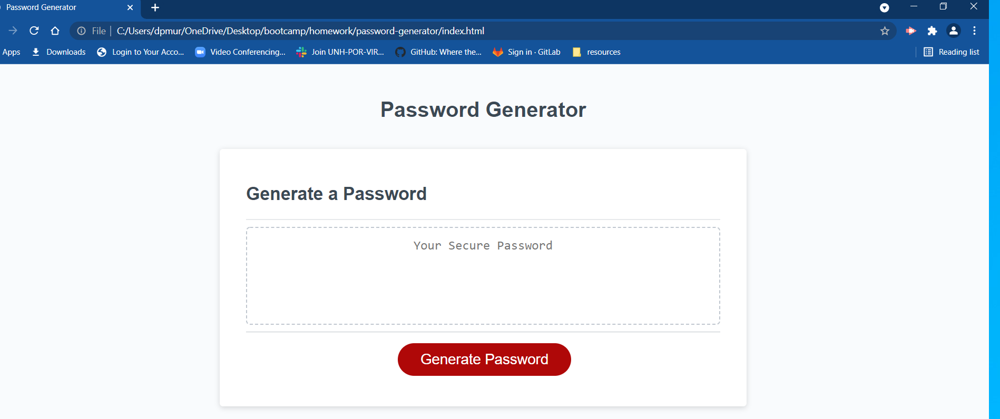

# 03 JavaScript: Password Generator

This is a web site that allows a user to generate a random password based on user input.

## Features
* The user interface adapts to multiple screen sizes
* The user is promted to select from multiple character types and enter a value between 8 and 128
* The user input is validated and an error is displayed if validation fails
* A password is generated based on the user input
* The password is written to an html textarea element

## Implementation
* alert(), prompt(), and confirm() window methods are used for user interaction
* document.querySelectors are used
* an eventListener is added for the button and the main function is called when the event occurs
* preventDefault() is used on the event so the page doesn't refresh
* an object is used just for fun
* the "this" keyword is used to reference properties from within the object
* RegEx is used to check match on positive integers on for password length entered by user
* for loop , Math methods and array indexing are used to create password

**Repositoy:** <https://github.com/dpmurphy11/password-generator>

**Website:** <https://dpmurphy11.github.io/password-generator/>
